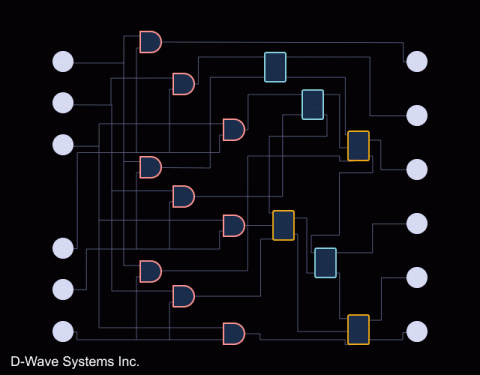
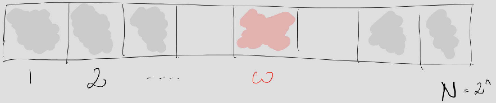
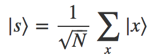
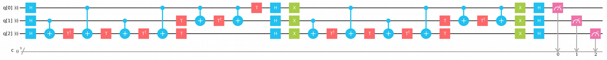
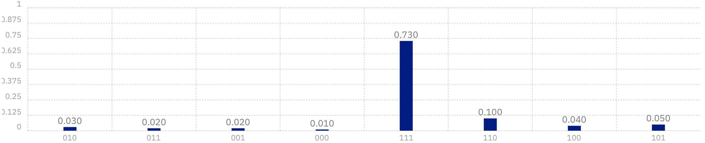
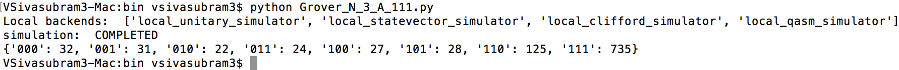
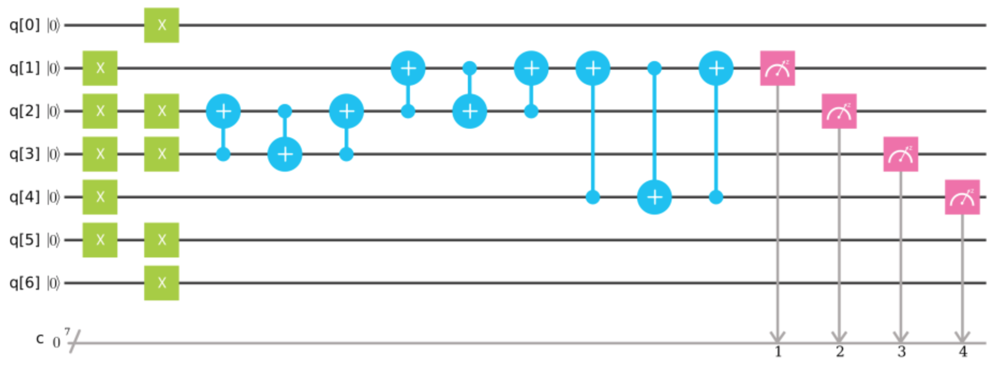
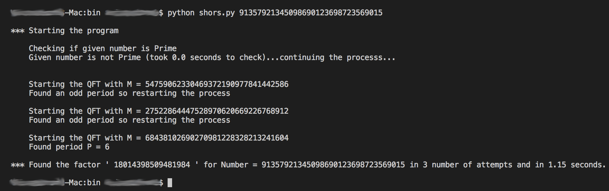
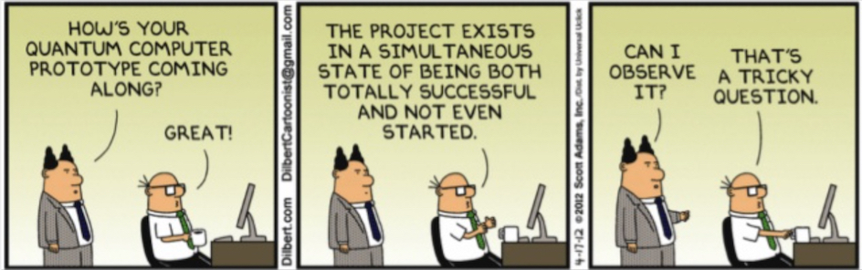

# Quantum-Computing

Quantum Computing is the next holy grail of Computer Science and Engineering.  Here we look at its background and implementation of few Quantum Algorithms.

<table>
  
  <tr>
    <a href="#what-is-quantum-computing">What is Quantum Computing?</a>
  </tr>
  <tr>
    <a href="#problem-set-classification">↳ Problem set classification</a>
  </tr>

</table>

|1. [What is Quantum Computing?](#what-is-quantum-computing)|
|   * [Problem set classification](#problem-set-classification)|
|   * [Basic Maths](#basic-maths)|
|2. [Implementation of few Quantum algorithms](#implementation-of-few-quantum-algorithms)|

   * [Grover's Algorithm](#grovers-algorithm)
     * [Implementation](#implementation)
   * [Shor's Alogrithm](#shors-algorithm)
     * [Implementation - specific factorization](#implementation---specific-factorization)
     * [Implementation - generalized](#implementation---generalized)
   * [Molecule Simulation](#molecule-simulation)
   * [Video](#video)
   * [Other Algorithms](#other-algorithms)
3. [Feedback](#feedback)

## What is Quantum Computing?

<p align="center">
  </img>
</p>

We have all heard the buzz around Quantum Computers.  Today’s smartphones have the computing power of a military computer from 50 years ago that was the size of an entire room. However, even with the phenomenal strides we have made in technology and classical computers since the onset of the computer revolution, there remain problems that classical computers just can’t solve.  Even though a classical computer helps us do many amazing things, “under the hood” it’s really just a calculator that uses a sequence of bits—values of 0 and 1 to represent two states (think on and off switch) to makes sense of and decisions about the data we input following a prearranged set of instructions. 

When you enter the world of atomic and subatomic particles, things begin to behave in unexpected ways. In fact, these particles can exist in more than one state at a time. It’s this ability that Quantum Computers take advantage of.  Instead of bits, which conventional computers use, a Quantum Computer uses Quantum bits—known as Qubits. To illustrate the difference, imagine a sphere. A bit can be at either of the two poles of the sphere, but a Qubit can exist at any point on the sphere (called "Superposition"). So, this means that a computer using Qubits can store an enormous amount of information and uses less energy doing so than a classical computer. Another interesting aspect is called "Quantum Entanglement".  It is a physical phenomenon which occurs when pairs or groups of particles are generated, interact, or share spatial proximity in ways such that the quantum state of each particle cannot be described independently of the state of the other(s), even when the particles are separated by a large distance—instead, a quantum state must be described for the system as a whole.  Measurements of physical properties such as position, momentum, spin, and polarization, performed on entangled particles are found to be correlated. 

<p align="center">
  </img>
</p>

By entering into this Quantum area of computing where the traditional laws of Physics no longer apply, we will be able to create Quantum Processors that are significantly faster (a million or more times) than the ones we use today. it will be game-changing for every industry and will have a huge impact in the way we do business, invent new medicine and materials, safeguard our data, explore space, and predict weather events and climate change. It’s no coincidence that some of the world’s most influential companies such as IBM and Google and the world’s governments are investing in Quantum Computing technology. They are expecting Quantum Computing to change our world because it will allow us to solve problems and experience efficiencies that aren’t possible today.

Check out this excellent introductory YoutTube video:

<p align="center">
  <a href="https://www.youtube.com/watch?v=JhHMJCUmq28">
    </img>
  </a>
</p>

### Problem set classification

Quantum Computers are not intended to replace classical computers, they are expected to be a different tool we will use to solve complex problems that are beyond the capabilities of a classical computer:

<p align="center">
  </img>
</p>

### Basic Maths

If you are interested in the basic maths behind quantum computing, check it out here:

<p align="center">
  <a href=https://www.slideshare.net/secret/Fxp6COhuhGAKF>
    </img>
  </a>
</p>


[Goto Top](#quantum-computing)

## Implementation of few Quantum algorithms
Before we start off examining few Quantum Algorithms, a brief about the state of Quantum Computers.  As mentioned before, several Fortune 50 companies including IBM, Microsoft, Google are all working on creating Quantum Computers.  IBM has created a public cloud platform called [IBM Quantum Experience or IBM QX](https://en.wikipedia.org/wiki/IBM_Q_Experience).  As of July 2018, this has five Quantum Processors (with three of them available to public) as well as a Quantum Simulator:

<p align="center">
  </img>
</p>

Users interact with a quantum processor through the Quantum Circuit model of computation, applying Quantum Gate on the Qubits using a GUI called the Quantum Composer, writing Quantum Assembly Language (QASM) code or through a high level programming level like Python accessing IBM QX via API by using [QISKit](https://developer.ibm.com/code/open/projects/qiskit/).

Similarly D-Wave Systems has opened up free access to its [D-Wave 2000Q quantum computer](https://www.dwavesys.com/d-wave-two-system).

<p align="center">
  </img>
</p>

Called "[Leap](https://cloud.dwavesys.com/leap/)", the cloud based Quantum Application Environment provides access to a live quantum computer along with a SDK called "[Ocean SDK](https://github.com/dwavesystems/dwave-ocean-sdk)" for implementing algorithms with Python.

### Grover's Algorithm
We are now in a good place to discuss our first Quantum algorithm.

One of the many advantages a Quantum Computer has over a classical computer is its superior speed searching databases. Grover’s Algorithm (GA) demonstrates this capability. This algorithm can speed up an unstructured search problem quadratically, but its uses extend beyond that; it can serve as a general subroutine to obtain quadratic run time improvements for a variety of other algorithms. 

Suppose you are given a large <i>unsorted</i> list of "N" items. Among these items there is one item with a unique property that we wish to locate; we will call this one the winner "ω". Think of each item in the list as a box of a particular color. Say all items in the list are gray except the winner "ω", which is pink.

<p align="center">
  </img>
</p>

To find the pink box – the <i>marked item</i> – using classical computation, one would have to check on average N/2 of these boxes, and in the worst case, all "N" of them. On a Quantum Computer, however, we can find the marked item in roughly √N steps with Grover’s algorithm.  For ex., if N = (1 billion) items, then Grover's search would only require √(1 billion) ≈ 31623 checks!  A quadratic speedup is indeed a substantial time-saver for finding marked items in long lists. Additionally, the algorithm does not use the list’s internal structure, which makes it generic; this is why it immediately provides a quadratic Quantum speed-up for many classical problems.

Coming back to our unsorted database with "N" entries.  GA requires an N-dimensional state space H, which can be supplied by log2N qubits.

Let us number the database entries by 0, 1, ... (N-1). Choose an observable, Ω, acting on H, with N distinct eigenvalues whose values are all known. Each of the eigenstates of Ω encode one of the entries in the database, in a manner that we will describe. Denote the eigenstates (using bra-ket notation) as

{∣0⟩, ∣1⟩, ⋯, ∣N − 1⟩}

and the corresponding eigenvalues by

{λ0, λ1, ⋯, λN − 1}

We are provided with a unitary operator, Uω, which acts as a subroutine that compares database entries according to some search criterion. The algorithm does not specify how this subroutine works, but it must be a quantum subroutine that works with superpositions of states. Furthermore, it must act specially on one of the eigenstates, |ω>, which corresponds to the database entry matching the search criterion. To be precise, we require Uω to have the following effects:

Uω∣ω⟩ =  − ∣ω⟩

Uω∣x⟩ = ∣x⟩  for all x ≠ ω

Our goal is to identify this eigenstate |ω>, or equivalently the eigenvalue ω, that Uω acts specially upon.

The steps of GA are as follows:

1.  Initialize the system to the state </img>.

2.  Perform the following "Grover iteration" <i>r(N)</i> times. The function <i>r(N)</i> is described below:
    <br>a.  Apply the operator Uω
    <br>b.  Apply the operator Us = 2∣s⟩⟨s∣ − I.

3.  Perform the measurement Ω. The measurement result will be λω with probability approaching 1 for N>>1. From λω, ω may be obtained.

For those of you mathematically inclined, the original Grover's paper is available [here](https://arxiv.org/pdf/quant-ph/9605043.pdf).

[Goto Top](https://github.com/svaidyans/Quantum-Computing#quantum-computing)

#### Implementation
Let us try implementing GA with 3 qubits (8 combinations) and as ω as |111>.  To recall, GA is represented as:

<p align="center">
  </img>
</p>

I have deployed this as Quantum Circuit in the IBM QX's QASM Composer as follows:
<p align="center">
  </img>
</p>
The QASM code is below:

```
//Name of Experiment: Grover N=3 A=111 
//Version: v2 
//Date: 05Jul2018 
//Developer:  Vaidyanathan Sivasubramanian

OPENQASM 2.0;
include "qelib1.inc";

qreg q[3];
creg c[3];

h q[0];
h q[1];
h q[2];
cx q[1],q[2];
tdg q[2];
cx q[0],q[2];
t q[2];
cx q[1],q[2];
tdg q[2];
cx q[0],q[2];
t q[1];
t q[2];
cx q[0],q[1];
tdg q[1];
cx q[0],q[1];
t q[0];
h q[0];
h q[1];
h q[2];
x q[0];
x q[1];
x q[2];
cx q[1],q[2];
tdg q[2];
cx q[0],q[2];
t q[2];
cx q[1],q[2];
tdg q[2];
cx q[0],q[2];
t q[1];
t q[2];
cx q[0],q[1];
tdg q[1];
cx q[0],q[1];
x q[0];
x q[1];
x q[2];
h q[0];
h q[1];
h q[2];
measure q[0] -> c[0];
measure q[1] -> c[1];
measure q[2] -> c[2];
```

Output from a Composer execution is as below:
<p align="center">
  </img>
</p>

Python code is:

```
# Name: Grover_N_3_A111.py
# Version: v1
# Description: Grover's Algorithm implementing with 3 Qubits for A=111 on local device
# Date: 05Jul2018
# Developer: Vaidyanthan Sivasubramanian.

# Import the QISKit SDK
from qiskit import QuantumCircuit, ClassicalRegister, QuantumRegister
from qiskit import available_backends, execute

# Create a Quantum Register with 3 Qubits
q = QuantumRegister ( 3 )
# Create a Classical Register with 3 bits
c = ClassicalRegister ( 3 )
# Create a Quantum Circuit
qc = QuantumCircuit ( q, c )

# Add H gates on the Qubits
qc.h ( q[0] )
qc.h ( q[1] )
qc.h ( q[2] )

# Add a CX (CNOT) gate on Control Qubit 1 and Target Qubit 2, for
# putting the Qubits in a Bell State
qc.cx ( q[1], q[2] )

# Add a transposed conjugate T gate on Target Qubit
qc.tdg ( q[2] )

# Add a CX (CNOT) gate on Control Qubit 0 and Target Qutbit 2, for
# putting the Qubits in a Bell State
qc.cx ( q[0], q[2] )

# Add a T gate on Target Qubit 2
qc.t ( q[2] )

# Add a CX (CNOT) gate on Control Qubit 1 and Target Qutbit 2, for
# putting the Qubits in a Bell State
qc.cx ( q[1], q[2] )

# Add a transposed conjugate T gate on Target Qubit
qc.tdg ( q[2] )

# Add a CX (CNOT) gate on Control Qubit 0 and Target Qutbit 2, for
# putting the Qubits in a Bell State
qc.cx ( q[0], q[2] )

# Add a T gate on Target Qubit 1
qc.t ( q[1] )

# Add a T gate on Target Qubit 2
qc.t ( q[2] )

# Add a CX (CNOT) gate on Control Qubit 0 and Target Qutbit 1, for
# putting the Qubits in a Bell State
qc.cx ( q[0], q[1] )

# Add a transposed conjugate T gate on Target Qubit
qc.tdg ( q[1] )

# Add a CX (CNOT) gate on Control Qubit 0 and Target Qutbit 1, for
# putting the Qubits in a Bell State
qc.cx ( q[0], q[1] )

# Add a T gate on Target Qubit 0
qc.t ( q[0] )

# Add H gates on the Qubits
qc.h ( q[0] )
qc.h ( q[1] )
qc.h ( q[2] )

# Add X gates on the Qubits
qc.x ( q[0] )
qc.x ( q[1] )
qc.x ( q[2] )

# Add a CX (CNOT) gate on Control Qubit 1 and Target Qutbit 2, for
# putting the Qubits in a Bell State
qc.cx ( q[1], q[2] )

# Add a transposed conjugate T gate on Target Qubit
qc.tdg ( q[2] )

# Add a CX (CNOT) gate on Control Qubit 0 and Target Qutbit 2, for
# putting the Qubits in a Bell State
qc.cx ( q[0], q[2] )

# Add a T gate on Target Qubit 2
qc.t ( q[2] )

# Add a CX (CNOT) gate on Control Qubit 1 and Target Qutbit 2, for
# putting the Qubits in a Bell State
qc.cx ( q[1], q[2] )

# Add a transposed conjugate T gate on Target Qubit
qc.tdg ( q[2] )

# Add a CX (CNOT) gate on Control Qubit 0 and Target Qutbit 2, for
# putting the Qubits in a Bell State
qc.cx ( q[0], q[2] )

# Add T gates on Qubits 1 and 2
qc.t ( q[1] )
qc.t ( q[2] )

# Add a CX (CNOT) gate on Control Qubit 0 and Target Qutbit 1, for
# putting the Qubits in a Bell State
qc.cx ( q[0], q[1] )

# Add a transposed conjugate T gate on Target Qubit
qc.tdg ( q[1] )

# Add a CX (CNOT) gate on Control Qubit 0 and Target Qutbit 1, for
# putting the Qubits in a Bell State
qc.cx ( q[0], q[1] )

# Add X and H gates on Qubits
qc.x ( q[0] )
qc.x ( q[1] )
qc.x ( q[2] )

qc.h ( q[0] )
qc.h ( q[1] )
qc.h ( q[2] )

# Add a Measure gates to see the States
qc.measure ( q[0], c[0] )
qc.measure ( q[1], c[1] )
qc.measure ( q[2], c[2] )

# See a list of available local simulators
print ( "Local backends: ", available_backends ( { 'local': True } ) )

# Compile and run the Quantum circuit on a simulator backend
job_sim = execute( qc, "local_qasm_simulator" )
sim_result = job_sim.result ()

# Show the results
print ( "simulation: ", sim_result )
print ( sim_result.get_counts ( qc ) )
```

Output from executing this on the local Simulator using QISKIT SDK is:
<p align="center">
  </img>
</p>

Voila!  We have successfully implemented Grover's Algorithm both on the IBM QX platform as well as on the local Simulator.

[Goto Top](#quantum-computing)

### Shor's Algorithm
Although any integer number has a unique decomposition into a product of primes, finding the prime factors is believed to be a hard problem. In fact, the security of our online transactions rests on the assumption that factoring integers with a thousand or more digits is practically impossible. This assumption has been challenged in 1995 when Peter Shor proposed a polynomial-time quantum algorithm for the factoring problem. Shor’s algorithm is arguably the most dramatic example of how the paradigm of quantum computing changed our perception of which problems should be considered tractable. In this section we briefly summarize some basic facts about factoring, highlight main ingredients of the Shor’s algorithm, and illustrate how it works using a factoring problem.

Suppose our task is to factor an integer N with d decimal digits. The brute force algorithm goes through all primes P up to √N
and checks whether P divides N. In the worst case, this would take time roughly √N which is exponential in the number of digits d.  A more efficient algorithm known as the Quadratic Sieve attempts to construct integers (a, b) such that (a^2 − b^2) is a multiple of N. Once such (a, b) are found, one checks whether a±b have common factors with N.  The Quadratic Sieve method has asymptotic runtime exponential in √d. The most efficient classical factoring algorithm known as General Number Field Sieve achieves an asymptotic runtime exponential in ∛d.  The exponential runtime scaling limits applicability of the classical factoring algorithms to numbers with a few hundred digits  with the world record being d=232 (which took roughly 2,000 CPU years).  In contrast, Shor’s factoring algorithm has runtime polynomial in d.

The detailed explanation and steps of Shor's Algorithm can be found [here](https://blogs.ams.org/mathgradblog/2014/04/30/shors-algorithm-breaking-rsa-encryption/).

#### Implementation - specific factorization
Let us factorize the number 91 as illustrated in the AMS blog above.  Below is the Quantum Circuit and QASM code to implement 62mod91:

<p align="center">
  </img>
</p>

```
//Name of Experiment: Shor's 62mod91 
//Version: v2 
//Date: 11Jul2018 
//Developer:  Vaidyanathan Sivasubramanian

include "qelib1.inc";
qreg q[7];
creg c[7];

x q[1];
x q[2];
x q[3];
x q[4];
x q[5];

x q[0];
x q[2];
x q[3];
x q[5];
x q[6];

cx q[3],q[2];
cx q[2],q[3];
cx q[3],q[2];
cx q[2],q[1];
cx q[1],q[2];
cx q[2],q[1];
cx q[4],q[1];
cx q[1],q[4];
cx q[4],q[1];

measure q[1] -> c[1];
measure q[2] -> c[2];
measure q[3] -> c[3];
measure q[4] -> c[4];
```

Output from a Composer execution is as below:
<p align="center">
  </img>
</p>

The full Python code implemenation is:

```
# Name: Shors_Factor_91.py
# Version: v1
# Description: Shors algorithm implementation for finding one factor of 91 
#              on a 7 qubit local simulator
# Date: 05Jul2018
# Developer: Vaidyanthan Sivasubramanian.

# Define the fuction to return GCD of two values 
def GCD ( a, b ):
    if ( b == 0 ):
       return ( a )
    else:
       return ( GCD ( b, a % b ) )

# Define the QFT function for 62mod91
def QFT ():
    # Import the QISKit SDK
    from qiskit import QuantumCircuit, ClassicalRegister, QuantumRegister
    from qiskit import available_backends, execute

    # Create a Quantum Register with 7 qubits
    q = QuantumRegister (7)

    # Create a Classical Register with 7 bits
    c = ClassicalRegister (7)

    # Create a Quantum Circuit
    qc = QuantumCircuit ( q, c )

    # Add the X gates
    qc.x ( q[1] );
    qc.x ( q[2] );
    qc.x ( q[3] );
    qc.x ( q[4] );
    qc.x ( q[5] );

    qc.x ( q[0] );
    qc.x ( q[2] );
    qc.x ( q[3] );
    qc.x ( q[5] );
    qc.x ( q[6] );

    # Add the CX gates
    qc.cx ( q[3], q[2] );
    qc.cx ( q[2], q[3] );
    qc.cx ( q[3], q[2] );
    qc.cx ( q[2], q[1] );
    qc.cx ( q[1], q[2] );
    qc.cx ( q[2], q[1] );
    qc.cx ( q[4], q[1] );
    qc.cx ( q[1], q[4] );
    qc.cx ( q[4], q[1] );

    # Add the Measure gates
    qc.measure ( q[1], c[1] );
    qc.measure ( q[2], c[2] );
    qc.measure ( q[3], c[3] );
    qc.measure ( q[4], c[4] );

    # Compile and run the Quantum circuit on a simulator backend
    sim_job = execute ( qc, "local_qasm_simulator" )

    # Get the result and period

    import json

    sim_job_result = sim_job.result ()
    sim_job_counts = sim_job_result.get_counts ( qc )

    period = 0
    for key, value in sim_job_counts.items():
        key_data = int ( key, 2 )
        if ( period < key_data ):
            period = key_data

    return period

# Define the main function
def main ():

    # Initial values
    N = 91
    M = 3
    print ( "*** Starting the program" )
    print ( "    N =", N, "and M =", M )

    print ( "    Starting the QFT" )
    P = QFT ()
    r = int ( M ** ( P / 2 ) - 1 )
    print ( "    Period from QFT =", P, "and r =", r )

    factor = GCD ( r, N )
    print ( "*** Factor found =", factor )

main ()
```

Output from executing this on the local Simulator using QISKIT SDK is:
<p align="center">
  </img>
</p>

[Goto Top](#quantum-computing)

#### Implementation - generalized
Below is a Python code which implements Shor's Algorithm generalized for any number > 14 and less than 33 digits long:

```
# Name: Shors.py
# Version: v1
# Description: Shors algorithm implementation for finding one factor 
#              on a 5 qubit local simulator
# Date: 05Jul2018
# Developer: Vaidyanthan Sivasubramanian.

# Check if given Number is prime.  A variant of the classic O(sqrt(N)) 
# algorithm.  It uses the fact that a prime (except 2 and 3) is of 
# form 6k - 1 or 6k + 1 and looks only at divisors of this form.
def Is_Prime ( Number ):

    if Number == 2:
        return True

    if Number == 3:
        return True

    if Number % 2 == 0:
        return False

    if Number % 3 == 0:
        return False

    i = 5
    w = 2
    counter = 1

    while i * i <= Number:

        counter += 1
        if Number % i == 0:
            return False
        i += w
        w = 6 - w

    return True

# Define the fuction to return GCD of two values 
def GCD ( a, b ):

    if ( b == 0 ):
       return ( a )
    else:
       return ( GCD ( b, a % b ) )

# Define the QFT function
def QFT ():
    
    # Import the QISKit SDK
    from qiskit import QuantumCircuit, ClassicalRegister, QuantumRegister
    from qiskit import execute

    # Create a Quantum Register with 5 qubits
    Q = QuantumRegister (5)

    # Create a Classical Register with 5 bits
    C = ClassicalRegister (5)

    # Create a Quantum Circuit
    QC = QuantumCircuit ( Q, C )

    # Add the necessary gates
    QC.u2 ( 0.0, 3.2397674240144743, Q[4] )
    QC.u1 ( 0.196349540849362, Q[3] )
    QC.u2 ( 0.0, 3.5342917352885173, Q[2] )
    QC.u2 ( 0.0, 3.9269908169872414, Q[1] )
    QC.u1 ( 6.283185307179586, Q[0] )
    QC.cx ( Q[0], Q[1] )
    QC.u1 ( 6.283185307179586, Q[1] )
    QC.u3 ( 0.7853981633974485, 1.5707963267948966, 4.71238898038469, Q[0] )
    QC.cx ( Q[0], Q[1] )
    QC.u1 ( 6.283185307179586, Q[1] )
    QC.u3 ( -0.7853981633974485, 1.5707963267948966, 4.71238898038469, Q[0] )
    QC.cx ( Q[0], Q[2] )
    QC.u1 ( 6.283185307179586, Q[2] )
    QC.u3 ( 0.392699081698724, 1.5707963267948966, 4.71238898038469, Q[0] )
    QC.cx ( Q[0], Q[2] )
    QC.u2 ( 0.7853981633974485, 3.141592653589793, Q[2] )
    QC.u2 ( 0.392699081698724, 3.141592653589793, Q[0] )
    QC.cx ( Q[0], Q[2] )
    QC.u2 ( 0.0, 3.141592653589793, Q[0] )
    QC.u2 ( 0.0, 3.141592653589793, Q[2] )
    QC.cx ( Q[0], Q[2] )
    QC.u2 ( 0.0, 3.141592653589793, Q[2] )
    QC.u2 ( 0.0, 3.141592653589793, Q[0] )
    QC.cx ( Q[0], Q[2] )
    QC.cx ( Q[0], Q[1] )
    QC.u1 ( -0.7853981633974485, Q[1] )
    QC.cx ( Q[0], Q[1] )
    QC.u2 ( 0.0, 3.141592653589793, Q[0] )
    QC.u1 ( 0.7853981633974485, Q[1] )
    QC.cx ( Q[0], Q[1] )
    QC.u2 ( 0.0, 3.141592653589793, Q[0] )
    QC.u2 ( 0.0, 3.141592653589793, Q[1] )
    QC.cx ( Q[0], Q[1] )
    QC.u2 ( 0.0, 3.141592653589793, Q[1] )
    QC.u2 ( 0.0, 3.141592653589793, Q[0] )
    QC.cx ( Q[0], Q[1] )
    QC.u2 ( 0.0, 3.141592653589793, Q[0] )
    QC.cx ( Q[3], Q[2] )
    QC.u1 ( -0.196349540849362, Q[2] )
    QC.cx ( Q[3], Q[2] )
    QC.u1 ( 0.392699081698724, Q[3] )
    QC.u1 ( 0.196349540849362, Q[2] )
    QC.cx ( Q[3], Q[2] )
    QC.u2 ( 0.0, 3.141592653589793, Q[3] )
    QC.u2 ( 0.0, 3.141592653589793, Q[2] )
    QC.cx ( Q[3], Q[2] )
    QC.u2 ( 0.0, 3.141592653589793, Q[2] )
    QC.u2 ( 0.0, 3.141592653589793, Q[3] )
    QC.cx ( Q[3], Q[2] )
    QC.u2 ( 0.0, 3.141592653589793, Q[2] )
    QC.cx ( Q[0], Q[2] )
    QC.u1 ( 6.283185307179586, Q[2] )
    QC.u3 ( 0.392699081698724, 1.5707963267948966, 4.71238898038469, Q[0] )
    QC.cx ( Q[0], Q[2] )
    QC.u2 ( 0.7853981633974485, 3.141592653589793, Q[2] )
    QC.u2 ( 0.392699081698724, 3.141592653589793, Q[0] )
    QC.cx ( Q[0], Q[2] )
    QC.u2 ( 0.0, 3.141592653589793, Q[0] )
    QC.u2 ( 0.0, 3.141592653589793, Q[2] )
    QC.cx ( Q[0], Q[2] )
    QC.u2 ( 0.0, 3.141592653589793, Q[2] )
    QC.u2 ( 0.0, 3.141592653589793, Q[0] )
    QC.cx ( Q[0], Q[2] )
    QC.cx ( Q[0], Q[1] )
    QC.u1 ( -0.7853981633974485, Q[1] )
    QC.cx ( Q[0], Q[1] )
    QC.u1 ( 6.283185307179586, Q[0] )
    QC.u2 ( 0.0, 3.9269908169872414, Q[1] )
    QC.u2 ( 0.0, 3.141592653589793, Q[3] )
    QC.cx ( Q[3], Q[4] )
    QC.u1 ( 6.283185307179586, Q[4] )
    QC.u3 ( 0.098174770424681, 1.5707963267948966, 4.71238898038469, Q[3] )
    QC.cx ( Q[3], Q[4] )
    QC.u2 ( 0.196349540849362, 3.141592653589793, Q[4] )
    QC.u2 ( 0.098174770424681, 3.141592653589793, Q[3] )
    QC.cx ( Q[3], Q[4] )
    QC.u2 ( 0.0, 3.141592653589793, Q[3] )
    QC.u2 ( 0.0, 3.141592653589793, Q[4] )
    QC.cx ( Q[3], Q[4] )
    QC.u2 ( 0.0, 3.141592653589793, Q[4] )
    QC.u2 ( 0.0, 3.141592653589793, Q[3] )
    QC.cx ( Q[3], Q[4] )
    QC.cx ( Q[3], Q[2] )
    QC.u1 ( -0.196349540849362, Q[2] )
    QC.cx ( Q[3], Q[2] )
    QC.u1 ( 0.392699081698724, Q[3] )
    QC.u1 ( 0.196349540849362, Q[2] )
    QC.cx ( Q[3], Q[2] )
    QC.u2 ( 0.0, 3.141592653589793, Q[3] )
    QC.u2 ( 0.0, 3.141592653589793, Q[2] )
    QC.cx ( Q[3], Q[2] )
    QC.u2 ( 0.0, 3.141592653589793, Q[2] )
    QC.u2 ( 0.0, 3.141592653589793, Q[3] )
    QC.cx ( Q[3], Q[2] )
    QC.u2 ( 0.0, 3.141592653589793, Q[2] )
    QC.cx ( Q[1], Q[2] )
    QC.u1 ( 6.283185307179586, Q[2] )
    QC.u3 ( 0.392699081698724, 1.5707963267948966, 4.71238898038469, Q[1] )
    QC.cx ( Q[1], Q[2] )
    QC.u3 ( -0.7853981633974485,1.5707963267948966, 4.71238898038469, Q[2] )
    QC.cx ( Q[0], Q[2] )
    QC.u1 ( 6.283185307179586, Q[2] )
    QC.u3 ( 0.7853981633974485,1.5707963267948966, 4.71238898038469, Q[0] )
    QC.cx ( Q[0], Q[2] )
    QC.u1 ( 6.283185307179586, Q[2] )
    QC.u2 ( 0.7853981633974485, 3.141592653589793, Q[0] )
    QC.u2 ( 0.392699081698724, 3.141592653589793, Q[1] )

    # Add the Measure gates
    QC.measure ( Q, C )

    # Compile and run the Quantum circuit on a simulator backend
    Sim_Job = execute ( QC, "local_qasm_simulator" )

    # Get the result and period

    #import json
    Sim_Job_Result = Sim_Job.result ()
    Sim_Job_Counts = Sim_Job_Result.get_counts ( QC )

    Period = 0
    Value_Data = -1 
    for Key, Value in Sim_Job_Counts.items():
        Key_Data = int ( Key, 2 )
        if ( Value_Data < Value ):
           Period = Key_Data
           Value_Data = Value

    return Period

def Print_Factor ( Factor, Attempts ):
    
    End_Time = time.time ()
    Duration = End_Time - Start_Time
    print ( "\n*** Found the factor '", int ( Factor ), "' for Number =", Number, "in", Attempts, "number of attempts and in", round ( Duration, 3 ), "seconds.\n")

# Define the main function
def main ( Number ):

    N = Number
    Attempts = 0
    print ( "\n*** Starting the program\n" )

    print ( "    Checking if given number is Prime")
    End_Time = time.time ()
    Duration = End_Time - Start_Time
    if Is_Prime ( Number ):
       print ( "\n*** Given number", Number, "is a Prime! (took", round ( Duration, 3 ), "seconds to check)\n" )
       return
    else:
       print ( "    Given number is not Prime (took", round ( Duration, 3 ), "seconds to check)...continuing the processs...\n" )

    while True:

       Attempts += 1

       import random
       M = random.randint ( 2, N - 1 )

       # If GCD of ( M, N ) is != 1, that is ( M, N ) are coprime, then we have already have 
       # the non-trivial factor (that is a factor which is not 1 or N itself)!
       Divisor = GCD ( M, N )

       if ( Divisor != 1 ):
          Print_Factor ( Divisor, Attempts )
          break

       # Run the QFT to get the Period 'P' and coeffiennt 'R'
       print ( "\n    Starting the QFT with M =", M )
       P = QFT ()
       if ( P % 2 != 0 ) or ( P == 0 ):
          print ( "    Found an odd period so restarting the process" )
          continue
       else:
          print ( "    Found period P =", P )

       # Get the factor
       try:
           R = M ** ( P / 2 ) - 1
       except OverflowError:
           print ("    R value based on the period found is too big causing overflow so restarting the process...")
           continue

       Factor = GCD ( R, N )
       if ( ( Factor == 1 ) or ( Factor == N ) ):
          print ( "    Found a trivial factor ( 1 or the number itself ) so restarting the process..." )
          continue
       else:   
          Print_Factor ( Factor, Attempts )
          break

# Execute the main function

import time
Start_Time = time.time ()

import sys
Number = 0
if ( ( len ( sys.argv ) == 2 ) and ( sys.argv [1].isdigit () ) and ( len ( sys.argv [1] ) <= 32 ) ):
   Number = int ( sys.argv [1] )

if ( ( __name__ == "__main__" ) and ( Number > 14 ) ):
   main ( Number )
else:
   print ( "*** Usage is: python", sys.argv [0], "<number> where '<number>' should be > 14 and less than 33 digits long!\n" )
```

Output from executing this on the local Simulator using QISKIT SDK is:
<p align="center">
  </img>
</p>

[Goto Top](#quantum-computing)

### Molecule Simulation
Chemical reactions are quantum in nature, because they form highly entangled quantum superposition states. While the energies of molecular hydrogen can be computed classically (albeit inefficiently), working out the energy of something like a propane (C3H8) molecule would take a classical supercomputer in the region of 10 days.

Molecular simulation has enormous potential in chemistry with benefits ranging from better solar cells to medicines.

With Micorosoft's Quantum Development Kit ([QDK](https://www.microsoft.com/en-us/quantum/development-kit)) and a combination of Q# and C#, the energy levels at different bond lengths of a Hydrogen and Lithium Hydride molecule are simulated.  Estimates of the ground state energy which are a function of bond distance are computed using the quantum phase estimation algorithm, using Hamiltonian simulation by a Trotter-Suzuki integrator.  

The GitHub repository for Hydrogen and Lithium Hydrid simulations are availabe respectively [here](https://github.com/Microsoft/Quantum/tree/release/v0.3.1810/Samples/src/H2SimulationGUI), and [here](https://github.com/Microsoft/Quantum/tree/release/v0.3.1810/Chemistry/LithiumHydrideGUI).

[Goto Top](#quantum-computing)

### Video
A short video of the implementations of the above algorithms is available [here](https://youtu.be/c47eI3ZcE2Q).

### Other Algorithms
...are Work-In-Progress.  That is to say:
<p align="center">
  </img>
</p>

[Goto Top](#quantum-computing)

## Feedback
Please share any feedback to [Vaidyanathan Sivasubramanian](mailto:svaidyan_signup@hotmail.com).
